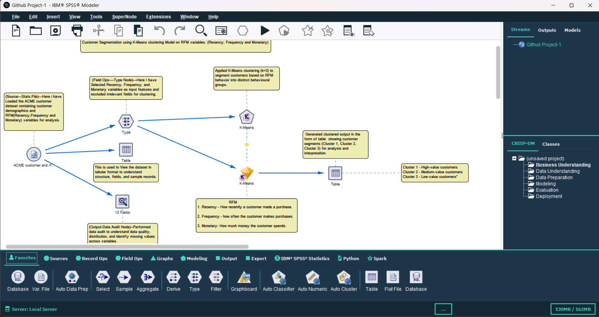
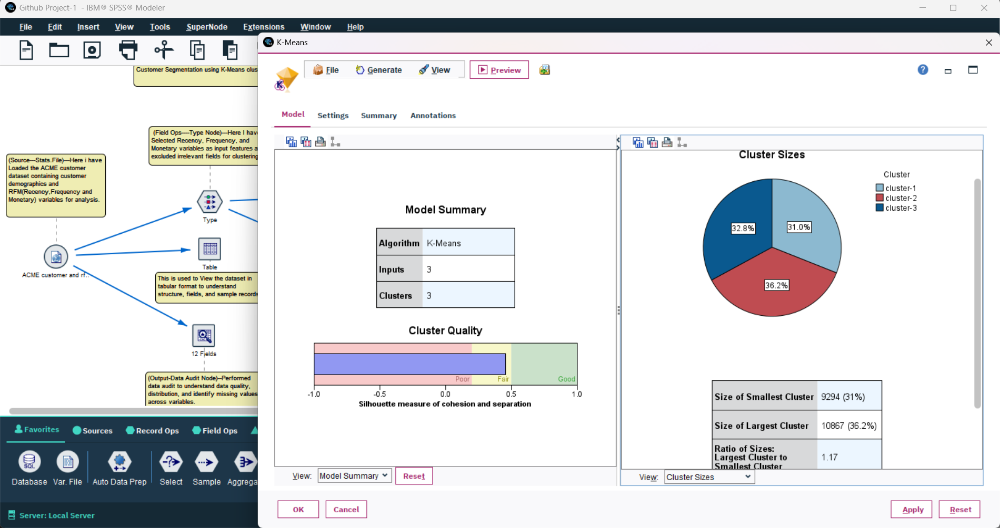
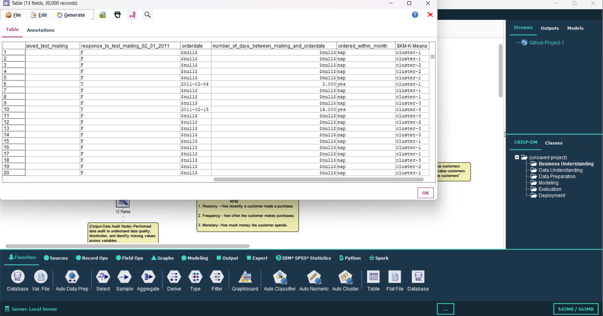

# Customer Segmentation using RFM & K-Means (IBM SPSS Modeler)

##  Project Overview
This project focuses on customer segmentation using RFM (Recency, Frequency, Monetary) analysis combined with K-Means clustering in IBM SPSS Modeler. The objective is to identify high-value, medium-value, and low-value customers to support data-driven business decisions.

---

##  Objective
- Analyze customer purchasing behavior
- Segment customers into meaningful groups
- Help businesses improve targeting and retention strategies

---

##  Tools & Technologies
- IBM SPSS Modeler
- K-Means Clustering
- RFM Analysis

---

##  Project Workflow
1. Data Understanding & Loading  
2. Data Cleaning and Preparation  
3. Feature Selection (RFM variables)  
4. K-Means Clustering (k=3)  
5. Cluster Interpretation  

---

##  Project Screenshots

### 🔹 SPSS Flow Diagram

### 🔹 K-Means Output

### 🔹 Cluster Visualization

---

##  Key Insights
- Cluster 1: High-value customers  
- Cluster 2: Medium-value customers  
- Cluster 3: Low-value customers  

---

##  Business Impact
- Helps in targeted marketing  
- Improves customer retention  
- Supports strategic decision-making

- ---

##  Business Interpretation

- High-value customers (Cluster 1) contribute the most revenue and should be targeted with loyalty programs and premium services.
- Medium-value customers (Cluster 2) can be nurtured through personalized offers to increase their lifetime value.
- Low-value customers (Cluster 3) should be engaged using cost-efficient strategies.

---

##  Strategic Insight

This segmentation allows businesses to move from generic marketing to targeted strategies, improving ROI and customer retention.
